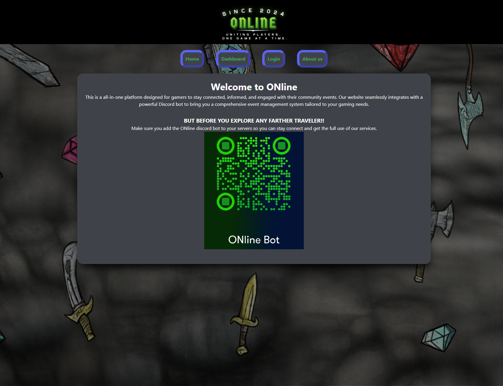

## ONline

  # License
  
  
## Description
  
  - A gaming community planner that syncs up to email and a discord bot!

  
  
## Table of Contents
  
  - [Installation](#installation)
  - [Features](#features)
  - [Contributors](#contributors)
  
## Installation
  
  - You'll need to have NodeJS and SQL installed to run this project.
  
  - After cloning to your local repo, you'll need to run 'npm i' in your terminal to install necessary packages. 
  
  - You'll need to setup your .env file with the required criteria.
  
## Features
  
  - Create events!

  - Sends emails!

  - Keeps track of events!

## Contributors
  
  - https://github.com/BunggoyLearn

  - https://github.com/JordanGWiz

  - https://github.com/RyanPetersen-89

  - https://github.com/CrisSal2
  